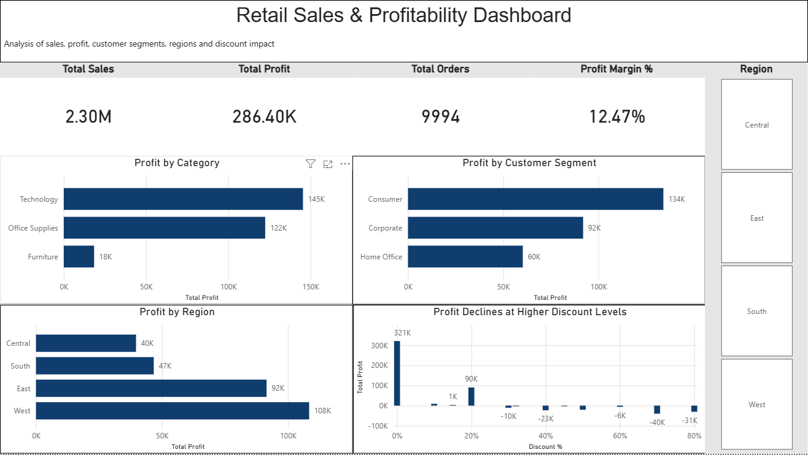

\# Retail Sales \& Profitability Analysis

\## Objective

The goal of this project is to analyze retail sales data to understand

profitability across products, customer segments, and regions, and to

identify key business insights that support data-driven decision-making.

\## Dataset

\- Source: Sample Superstore dataset

\- Records: ~9,000 orders

\- Description: Contains sales, profit, discount, product, customer, and regional information.

\## Tools Used

\- Excel: Initial data exploration and validation using pivot tables and charts

\- SQL (MySQL): Data storage and business-focused analysis

\- Power BI: Interactive dashboard for data visualization and insight delivery

\## Analysis Workflow

1\. Explored and validated raw data using Excel

2\. Created a relational table in MySQL

3\. Imported CSV data into the SQL database

4\. Performed SQL queries to analyze:

&nbsp;  - Overall business performance

&nbsp;  - Category profitability

&nbsp;  - Customer segments

&nbsp;  - Regional performance

&nbsp;  - Impact of discounts on profit

5\. Built an interactive Power BI dashboard to visualize insights

\## Key Questions

\- What is the overall sales and profit performance?

\- Which product categories are the most and least profitable?

\- Which customer segments contribute most to profit?

\- Are there regions or states that consistently underperform?

\- How do discounts impact profitability?

\## Key Insights

\- The Consumer segment is the most profitable, generating approximately €1.16M in sales and €134K in profit, making it the primary driver of business profitability.

\- The Central region is the weakest-performing region, with over 2,300 orders but relatively low profit, indicating potential operational inefficiencies or pricing challenges.

\- Texas is the least profitable state overall, contributing a significant negative impact on total profit.

\- Higher discount levels are strongly associated with lower profitability, suggesting that aggressive discounting erodes margins rather than driving sustainable growth.

\## Recommendations

\- Focus growth and retention efforts on the Consumer segment, which is the primary driver of profitability.

\- Prioritize Technology and Office Supplies categories, as they consistently generate the highest profit.

\- Review operations and pricing strategies in the Central region, particularly in Texas, to address persistent underperformance.

\- Re-evaluate discounting strategies, as higher discount levels are associated with declining and negative profitability.

\- Introduce targeted discounts only where they demonstrably increase sales without eroding margins.

\## Future Work

\- Perform time-based analysis if date fields become available to identify seasonal trends.

\- Extend analysis to product-level profitability to identify loss-making items.

\- Use Python to perform deeper exploratory analysis and automate reporting.

\- Enhance the dashboard with additional filters such as category and customer segment.

\- Incorporate cost data to better understand drivers of regional underperformance.

